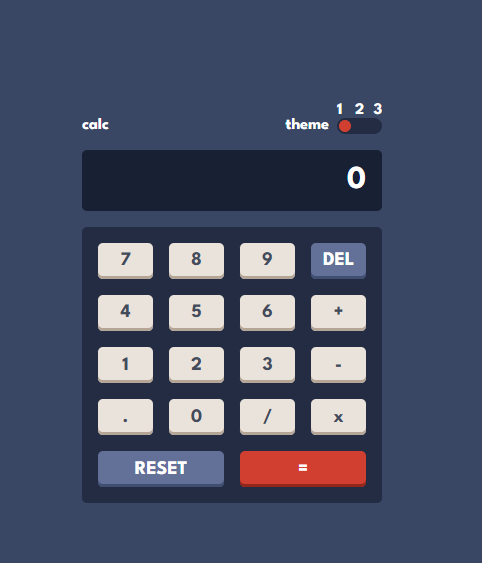

# Frontend Mentor - Calculator app solution

This is a solution to the [Calculator app challenge on Frontend Mentor](https://www.frontendmentor.io/challenges/calculator-app-9lteq5N29). Frontend Mentor challenges help you improve your coding skills by building realistic projects. 

## Table of contents

- [Overview](#overview)
  - [The challenge](#the-challenge)
  - [Screenshot](#screenshot)
  - [Links](#links)
- [My process](#my-process)
  - [Built with](#built-with)
  - [What I learned](#what-i-learned)
  - [Continued development](#continued-development)
  - [Useful resources](#useful-resources)
- [Author](#author)
- [Acknowledgments](#acknowledgments)

**Note: Delete this note and update the table of contents based on what sections you keep.**

## Overview

### The challenge

Users should be able to:

- See the size of the elements adjust based on their device's screen size
- Perform mathmatical operations like addition, subtraction, multiplication, and division
- Adjust the color theme based on their preference
- **Bonus**: Have their initial theme preference checked using `prefers-color-scheme` and have any additional changes saved in the browser

### Screenshot

### Links

- Solution URL: [Add solution URL here](https://www.frontendmentor.io/solutions/calculator-app-eJrpFLer8D)
- Live Site URL: [Add live site URL here](https://frontend-mentor-calculator-omega.vercel.app/)

## My process

### Built with

- Vue.js
- Flexbox

### What I learned

The project served me to remember my previous studies about Vue.js and even try the setup syntax, it also made me try to find creative ways to perform the operations and theme switching.

### Continued development

I'd like to learn more about web design and further my knowledge in Vue.js and other libraries.

## Author

- Frontend Mentor - [@Edgar-Avila](https://www.frontendmentor.io/profile/Edgar-Avila)